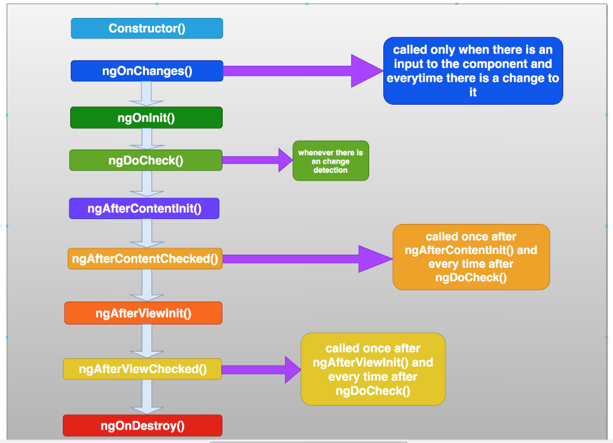

# Lifecycle hooks
Lifecycle hooks are a special functionality in Angular that allow us to run code at a specific lifecycle event of a component or directive.

## Angular Hooks
* ngOnChanges()
* **ngOnInit()**
* ngDoCheck()
* ngAfterContentInit()
* ngAfterContentChecked()
* **ngAfterViewInit()**
* ngAfterViewChecked()
* **ngOnDestroy()**

## Order of execution

## References
* [Angular - Lifecycle hooks](https://angular.io/guide/lifecycle-hooks)

## Version
This project was generated with Angular CLI version 14.1.3.